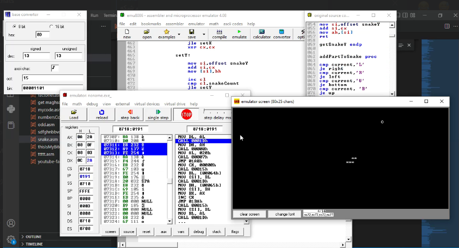

# 🐍 Snake Game in x86 Assembly

This is a **Snake Game** implemented from scratch in **x86 Assembly**, using BIOS and DOS interrupts for display and keyboard input. It’s a retro-style console game made for fun and educational purposes — built without any standard libraries or OS dependencies beyond DOSBox or similar emulators.

---

## 💾 About the Game

- The snake is drawn using the `*` character, and the fruit is shown as `O`.
- Game ends when the snake collides with itself.
- The game wraps around screen edges — classic arcade style.
- Keyboard input is handled via BIOS interrupt `INT 16h`.
- Screen output is done via `INT 10h` for direct character/attribute drawing.
- Written for 80x25 text mode (VGA-compatible).

---

## 🎮 Controls

| Key         | Action        |
|-------------|----------------|
| ⬅️ / ➡️ / ⬆️ / ⬇️  | Move snake       |
| `ESC`       | Exit the game |

Movement logic ensures the snake cannot reverse directly into itself (e.g., going right then immediately left is blocked).

---

## 🧠 Tech & Assembly Details

- **Language:** x86 Assembly (TASM-style)
- **Mode:** Real mode, 16-bit
- **Keyboard Input:** `INT 16h`
- **Graphics:** Text mode (via `INT 10h`)
- **Random Fruit Position:** Based on system ticks via `INT 1Ah`
- **Snake Storage:** Arrays (`snakeX` and `snakeY`) store the coordinates of the body parts
- **Game Loop:** Controlled using a simple delay + drawing routine
- **Collision Detection:** Checks if new snake head hits the body or a fruit

---

## 📁 Files Included

| File            | Description                         |
|-----------------|-------------------------------------|
| `snake.asm`     | Full source code                    |
| `screenshot.png`| Gameplay screenshot                 |

---

## 🏁 Screenshot

---

## 📜 License

This project is released under the MIT License. Feel free to fork, modify, or use it as a learning resource.

---

## 👤 Author

Made with low-level love ❤️ by Shahab
GitHub: [@shahabmosavi](https://github.com/shahabmosavi)
